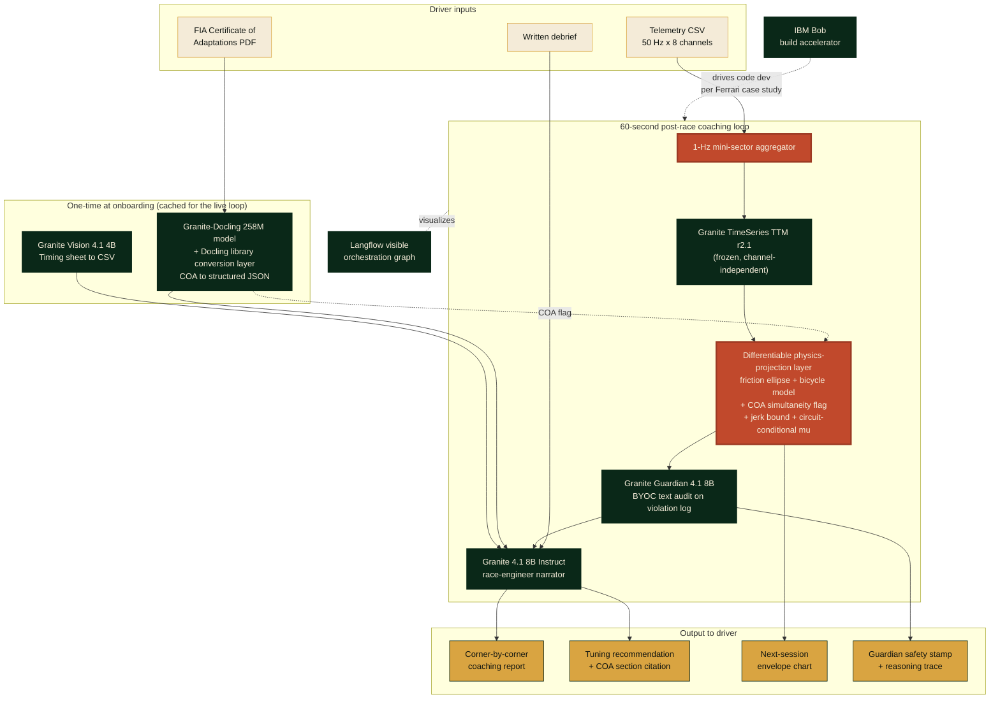

# APEX

> **AI race engineer for adaptive racers.**
> The same IBM Granite stack that powers Scuderia Ferrari's post-race fan app, pointed at the drivers who need a race engineer most.

[](LICENSE)
[](https://www.ibm.com/granite)
[](https://huggingface.co/spaces)
[](https://ibmskillsbuildchallenge-hub.bemyapp.com/)

Built for the **IBM SkillsBuild AI Builders Challenge, May 2026** (theme: "AI Beyond the Finish Line"). Submission deadline 2026-05-31, 11:59 PM ET.

---

## The three IBM-SkillsBuild submission answers

Per the BeMyApp pinned submission rubric, every project must clearly answer three questions in its README. APEX's answers below, with deep-links into the relevant sections.

- **The problem.** A professional race engineer costs hundreds of pounds per day, well beyond the budget of most adaptive racers, veteran-team drivers, and grassroots competitors. See [The problem](#the-problem).
- **The AI approach.** A frozen Granite TimeSeries TTM forecaster wrapped in a differentiable physics-projection layer audited by Granite Guardian, with COA-aware physics constraints as the architectural novelty. See [The AI approach](#the-ai-approach).
- **Why it matters in racing.** The FIA lifted its single-seater ban on disabled drivers in December 2017, but the regulatory barrier was replaced by an economic one. Adaptive racing is a real audience that current AI race-engineer tools systematically misdiagnose because they assume able-bodied physics. See [Why it matters in racing](#why-it-matters-in-racing).

---

<a id="the-problem"></a>

## The problem

A professional race engineer can cost **in the low-to-mid hundreds of pounds per day** for amateur and clubman series, by industry estimates we are still cross-checking against primary sources. Every F1 driver has one. Most adaptive racers, veteran-team drivers, and grassroots competitors do not. The FIA lifted its single-seater ban on disabled drivers in December 2017. The barrier stopped being regulatory. It became economic. Post-race coaching is a luxury good.

APEX changes that.

---

## Live demo

- **App:** *(Vercel URL lands Day 11)*
- **Video:** *(YouTube unlisted URL lands Day 10)*
- **Colab (zero install, browser-side):** *(notebook URL lands Day 9)*
- **Judges' tour:** *(apex.race/judges Day 11)*
- **Status dashboard:** *(apex.race/status Day 11)*
- **Try fixture:** Sarah Reynolds (fictional persona), RAF veteran, left-leg amputee, Britcar Trophy 2026, #34 BMW M240i with electronic hand-controls (supplier name redacted pending per-surface consent per the project's operator-attribution rule), Donington Park GP, Lap 17

---

<a id="the-ai-approach"></a>

## The AI approach

What makes APEX different from the existing AI race-engineer category (Track Titan, Trophi.ai, the Deep Dynamics PINN line):

### 1. First pretrained time-series foundation model on motorsport telemetry

We do not retrain. We take a frozen Granite TimeSeries TTM r2.1 forecaster, aggregate raw 50 Hz telemetry to 1-Hz mini-sector tensors that fit the model's published support envelope, and wrap the outputs in a differentiable physics-projection layer. To our knowledge no prior published work applies a non-physics TSFM to vehicle dynamics without retraining it from scratch (vs Deep Dynamics, which trains a bespoke PINN; vs Chronos-on-car-following, which uses a different forecaster on different inputs).

### 2. Differentiable physics-projection layer prevents kinetic hallucinations

TTM was pretrained on weather and retail. Without constraints, it can forecast 4G lateral with zero steering, or speed increasing with throttle at zero. APEX inserts a CvxpyLayer QP between the forecaster and the report. Every step satisfies the friction ellipse (`a_lat^2 + a_long^2 <= (mu * g)^2`), a forward-Euler kinematic check tying speed to longitudinal acceleration, and a bicycle-model tie between lateral G and steering angle. Constant-mu in V1, circuit-conditional lookup in V2.

### 3. FIA Certificate of Adaptations as a tensor-level safety flag

APEX is the only AI race engineer that reads the driver's binding FIA Certificate of Adaptations (governed by Appendix L of the International Sporting Code; specific article numbering verified against the live Appendix L PDF Day 2) at the tensor level. When a driver's COA permits simultaneous brake+throttle (as adaptive racing programmes and adapted-hand-control systems commonly do), the physics layer permits it. When a driver's COA does not permit it, the constraint enforces. Competing tools assume able-bodied physics (`throttle * brake = 0`) and systematically misdiagnose adaptive drivers.

### 4. Granite Guardian audits with BYOC custom rules + serialization unit tests

Every physics-corrected forecast and recommendation passes through Granite Guardian 4.1 with custom Bring-Your-Own-Classifier rules. The audit log is serialized to plain English with a unit-test suite covering every kinematic violation type (Convergence 14, the load-bearing safety contract). Reasoning trace surfaces in the UI in think-mode. The textual layer is a deliberate design choice with deliberate test coverage.

### 5. Eight IBM tools, all load-bearing

Granite-Docling, Granite Vision 4.1, Granite TimeSeries TTM r2.1, Granite 4.1 8B Instruct, Granite Guardian 4.1 8B, Langflow (visible orchestration), Docling library, IBM Bob (build accelerator, per the IBM × Scuderia Ferrari case-study precedent). Every tool earns its slot.

---

<a id="why-it-matters-in-racing"></a>

## Why it matters in racing

Three constituencies, one shared product gap.

- **Adaptive racers.** Drivers running hand-control rigs, prosthetic-leg-on-pedal setups, or other adapted controls compete in series like Britcar Trophy, the Adaptive Driver Championship, and FFSA Handikart. Their FIA Certificate of Adaptations (governed by Appendix L of the International Sporting Code) is a binding document that says, for example, that simultaneous brake-throttle inputs are permitted because the hand-control system supports them. Existing AI race-engineer tools assume an able-bodied physics model where `throttle * brake = 0`, so they read adaptive technique as driver error. APEX reads the COA at the tensor level. The same coaching pipeline says "lift earlier into Old Hairpin" for an able-bodied driver and "your COA permits the simultaneity you are running, the issue is brake-lever travel" for an adaptive driver in the same corner.
- **Veteran motorsport rehabilitation programmes.** Veteran-team drivers competing through programmes like Operation Motorsport often run with combat-injury-driven adaptations under the same COA framework. The economic barrier (the £500/day race engineer) is identical.
- **Grassroots clubman and amateur racers.** Britcar Trophy, SRO regional series, Britcar 12 Hour, club-level endurance racing. Post-race coaching is currently optional because it's a luxury good. APEX is free at the point of use for these audiences (Apache 2.0, Hugging Face Space hosted), open-source for any other developer to extend.

The Scuderia Ferrari precedent matters because IBM already shipped the same Granite stack to a Formula One team. APEX takes the same architecture and points it at the drivers who need it most, not the drivers who can already afford a paid race engineer.

---

## Architecture



Full architecture spec: [`docs/architecture-spec.md`](./docs/architecture-spec.md) (v0 live, Day 2 expansion). SVG export at `docs/architecture.svg` lands Day 11.

---

## Tech stack

**Frontend**
- Next.js 16 + React 19 + TypeScript strict
- TailwindCSS + IBM Plex Sans / Plex Mono + Fraunces (display)
- WCAG 2.1 AA from minute one (keyboard navigation, screen-reader labels, high contrast)
- Vercel deploy

**Backend**
- Python 3.12 + FastAPI
- Pydantic v2 (strict typed I/O)
- cvxpylayers (differentiable QP for physics projection)
- granite-tsfm + transformers + torch (Granite models)
- pytest + ruff + mypy strict
- Hugging Face Space (free tier) deploy with keep-alive cron

**AI (IBM Granite stack)**
- Granite-Docling 258M (COA structured-document extraction)
- Granite Vision 4.1 4B (timing-sheet chart and table extraction)
- Granite TimeSeries TTM r2.1 (NeurIPS 2024 Tiny Time Mixers, zero-shot multivariate forecasting)
- Granite 4.1 8B Instruct (race-engineer narrative)
- Granite Guardian 4.1 8B (BYOC custom-rules safety classifier)
- Langflow (visible agentic orchestration)
- IBM Bob (build accelerator, per IBM × Scuderia Ferrari case study)

**Data**
- FastF1 telemetry slices (public)
- SRO Motorsports + Britcar timing-sheet PDFs (public)
- FIA Vehicle Adaptation Guidelines + Appendix L (public)
- Synthetic adaptive-driver persona (Sarah Reynolds) for the canned demo case

---

## Hard compliance rules

- No em-dash in prose, commits, deck, video transcript, emails. Single most reliable AI-tone tell. Substitutes per global CLAUDE.md em-dash table (`docs/ai-tone-policy.md` Day 2 carve-out forthcoming).
- No invented FIA Article numbers. Verify via FIA.com or `research/` PDFs.
- No named operators (adaptive-racing-programme drivers, charity contacts) without explicit per-surface consent. Defaults to anonymous and aggregate descriptions.
- No NIL violations. Sarah Reynolds is a fictional persona by design.
- No git hooks. `.git/hooks/` stays defaults-only. Coordination is manual via PLAN.md edits per D-006.
- Conditional phrasing on physics claims ("forecast envelope" not "guaranteed pace").
- Every coaching claim cites a specific COA section and FIA Article via the provenance footer.

---

## Run locally

```bash
git clone https://github.com/StephenSook/apex.git
cd apex

# Backend
cd app/backend
python3 -m venv .venv && source .venv/bin/activate
pip install -r requirements.txt   # Day 2 onwards
uvicorn apex.main:app --reload --port 8000

# Frontend (new terminal)
cd app/frontend
npm install
npm run dev   # http://localhost:3000

# Try the canned Sarah Reynolds demo via the live UI
# Day 2: open http://localhost:3000/analyze, then drag the bundled fixtures:
#   app/frontend/public/fixtures/sarah-lap-17.csv
#   app/frontend/public/fixtures/sarah-coa.pdf
# Fill the debrief + driver-id fields, click "Generate coaching report".
#
# Day 6+ (post-G6 integration): the backend CLI handles the same flow:
# cd app/backend
# python -m apex.cli analyze \
#   --telemetry ../../fixtures/telemetry/sarah-lap-17.csv \
#   --coa ../../fixtures/coa/sarah-coa.json \
#   --debrief ../../fixtures/personas/sarah-debrief.txt
```

---

## Team

- **Stephen Sookra** (frontend + pitch + project architect) - [LinkedIn](https://www.linkedin.com/in/stephen-sookra-633682339/) - [GitHub](https://github.com/StephenSook) - [stephensookra.com](https://stephensookra.com)
- **Vinh Le** (backend + ML pipeline + data + AI)

---

## Build status

| Phase | Days | State |
|-------|------|-------|
| 0 - Bootstrap | Day 1 (2026-05-20) | 🟡 IN PROGRESS |
| 1 - Document parsing (Docling + Vision) | Day 2 | ⬜ pending |
| 2 - Physics layer (NumPy V1 → CvxpyLayer V2 + Guardian) | Days 3-5 | ⬜ pending |
| 3 - Narrator (Granite 4.1 8B Instruct + COA flag) | Day 6 | ⬜ pending |
| 4 - Orchestration + polish (Langflow + caching + June bridge) | Days 7-8 | ⬜ pending |
| 5 - Demo + deploy (HF + Colab + sim-rig + video) | Days 9-10 | ⬜ pending |
| 6 - Submission package (judges page + methodology + NeurIPS draft) | Day 11 | ⬜ pending |
| 7 - Submit | Day 12 (2026-05-31) | ⬜ pending |

Full status table: `PLAN.md`. Daily handoff template: `STATUS_TEMPLATE.md`.

Calibration ceiling (NotebookLM Phase 5 verification pass): **90% top-3 / 96% Best Use of Technology / 88% Most Innovative.**

---

## License

Apache 2.0. See [LICENSE](./LICENSE).
