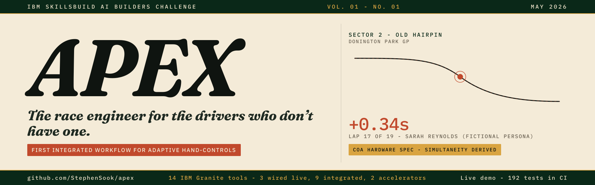
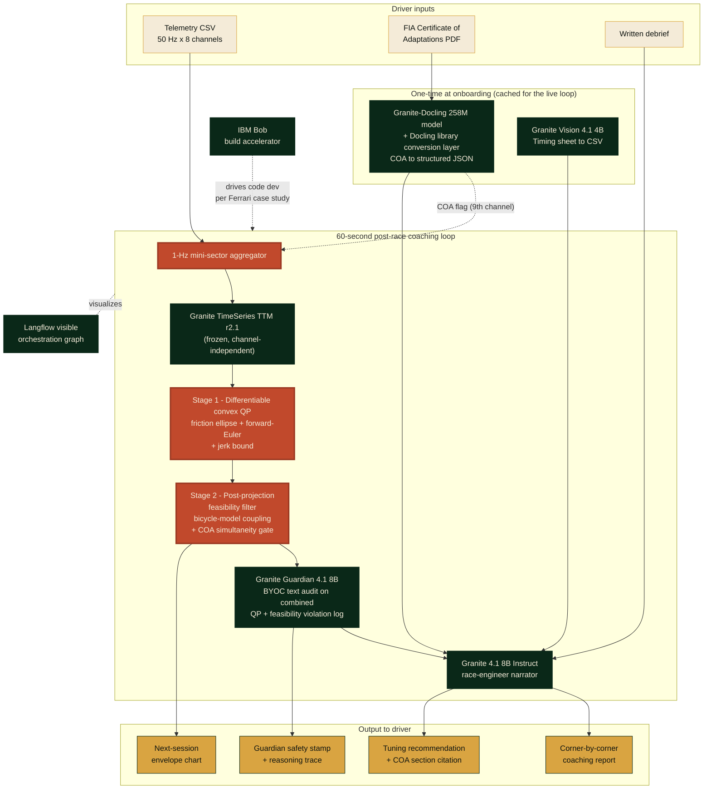

# APEX



> **AI race engineer for adaptive racers.**
> The same IBM Granite stack that powers Scuderia Ferrari's post-race fan app, pointed at the drivers who need a race engineer most.

[](LICENSE)
[](https://www.ibm.com/granite)
[](https://apex-one-black.vercel.app)
[](https://ibmskillsbuildchallenge-hub.bemyapp.com/)

Built for the **IBM SkillsBuild AI Builders Challenge, May 2026** (theme: "AI Beyond the Finish Line"). Submission deadline 2026-05-31, 11:59 PM ET.

---

## The three IBM-SkillsBuild submission answers

Per the BeMyApp pinned submission rubric, every project must clearly answer three questions in its README. APEX's answers below, with deep-links into the relevant sections.

- **The problem.** A professional race engineer costs hundreds of pounds per day, well beyond the budget of most adaptive racers, veteran-team drivers, and grassroots competitors. See [The problem](#the-problem).
- **The AI approach.** A frozen Granite TimeSeries TTM forecaster wrapped in a two-stage validator (differentiable convex QP for friction-ellipse + forward-Euler + jerk-bound constraints, plus a post-projection feasibility filter for the nonconvex bicycle-model coupling and COA-parameterized brake-throttle simultaneity gate) and audited by Granite Guardian. The COA-parameterized simultaneity gate is, to the best of our literature review through 2026-Q2, the first public AI race-engineer workflow we found that reads FIA Certificate of Adaptations data as a binding regulatory input; if a prior workflow is identified, the claim narrows accordingly (full scoping in paper §5.3). See [The AI approach](#the-ai-approach).
- **Why it matters in racing.** The FIA lifted its single-seater ban on disabled drivers in December 2017, but the regulatory barrier was replaced by an economic one. Adaptive racing is a real audience that current AI race-engineer tools systematically misdiagnose because they assume able-bodied physics. See [Why it matters in racing](#why-it-matters-in-racing).

---

<a id="the-problem"></a>

## The problem

A paid race engineer is a luxury good for amateur and clubman series. Every F1 driver has one. Most adaptive racers, veteran-team drivers, and grassroots competitors do not. The FIA lifted its single-seater ban on disabled drivers in December 2017. The barrier stopped being regulatory. It became economic.

APEX changes that.

---

## Live demo

- **App:** [https://apex-one-black.vercel.app](https://apex-one-black.vercel.app) (Vercel production deploy)
- **Video:** *(YouTube unlisted URL pending Day 10 record per `deliverables/demo-video-script-3min.md`)*
- **Colab (zero install, browser-side):** `deliverables/apex-demo.ipynb`
- **Judges' tour:** [https://apex-one-black.vercel.app/judges](https://apex-one-black.vercel.app/judges)
- **Status dashboard:** [https://apex-one-black.vercel.app/status](https://apex-one-black.vercel.app/status)
- **Try fixture:** Sarah Reynolds (fictional persona), RAF veteran, left-leg amputee, Britcar Trophy 2026, #34 BMW M240i with MME Motorsport electronic hand-controls (per consent receipt 2026-05-22 from MME Motorsport d.o.o. logged in `docs/consent-log.md`), Donington Park GP, Lap 17

---

<a id="the-ai-approach"></a>

## The AI approach

What makes APEX different from the existing AI race-engineer category (Track Titan, Trophi.ai, the Deep Dynamics PINN line):

### 1. First application of a pretrained time-series foundation model to adaptive motorsport telemetry

We do not retrain. We take a frozen Granite TimeSeries TTM r2.1 forecaster, aggregate raw 50 Hz telemetry to 1-Hz mini-sector tensors that fit the model's published support envelope, and wrap the outputs in a two-stage projection-and-audit layer. To our knowledge no prior published work applies a non-physics TSFM to vehicle dynamics without retraining it from scratch (vs Deep Dynamics, which trains a bespoke PINN; vs Chronos-on-car-following, which uses a different forecaster on different inputs).

### 2. Two-stage projection-and-audit layer prevents kinetic hallucinations

TTM was pretrained on weather and retail. Without constraints, it can forecast 4G lateral with zero steering, or speed increasing with throttle at zero. APEX inserts a two-stage validator between the forecaster and the report. Stage 1 is a differentiable CvxpyLayer QP that enforces the convex constraints (friction ellipse `a_lat^2 + a_long^2 <= (mu * g)^2`, a forward-Euler kinematic step tying speed to longitudinal acceleration, and a jerk bound). Stage 2 is a post-projection feasibility filter that audits the nonconvex constraints (bicycle-model coupling between lateral G, steering angle, and speed; COA-parameterized brake-throttle simultaneity gate). Per wave-30 D-012 + D-013 + D-015, the convex stage becomes the inner iterate of an unrolled SCP outer loop fixed at 3 iterations through cvxpylayers; the 8-tier non-convex physics (Pacejka combined-slip + transient tire + thermal + double-track load transfer + 3D track + aero + adaptive hand-controls + kinematic integration) is handled by first-order Taylor linearisation around the previous iterate. Constant-mu is the convex inner-iterate parameterisation; the circuit-conditional lookup + Pacejka load-dependent slip model run as wave-30 in-scope tiers handled by the outer-loop linearisation.

### 3. FIA Certificate of Adaptations as a tensor-level safety flag

The COA-parameterized simultaneity gate is, to the best of our literature review through 2026-Q2, the first public AI race-engineer workflow we found that reads the driver's binding FIA Certificate of Adaptations (governed by Appendix L of the International Sporting Code; specific article numbering verified against the live Appendix L PDF Day 2) at the tensor level. When a driver's COA permits simultaneous brake+throttle (as adaptive racing programmes and adapted-hand-control systems commonly do), Stage 2's feasibility filter recognises it. When a driver's COA does not permit it, the gate flags the input. Public documentation for the leading commercial AI race-engineer tools we surveyed (Track Titan, Trophi.ai) does not document any conditional removal of the able-bodied `throttle * brake = 0` mutual-exclusion assumption nor any FIA-Certificate-of-Adaptations parsing path; if a prior workflow is identified, the "first" claim narrows accordingly (full scoping in paper §5.3).

### 4. Granite Guardian audits with BYOC custom rules + serialization unit tests

Every physics-corrected forecast and recommendation passes through Granite Guardian 4.1 with custom Bring-Your-Own-Classifier rules. The audit log is serialized to plain English with a unit-test suite covering every kinematic violation type (Convergence 14, the load-bearing safety contract). Reasoning trace surfaces in the UI in think-mode. The textual layer is a deliberate design choice with deliberate test coverage.

### 5. Twelve IBM tools, per-tool honesty tier

The 12-tool inventory carries a wire-up tier per tool surfaced as a status pill on the /judges page and the / page StackBadges grid (wave-44 Phase 4 BLOCKER 4 honesty audit). Two wired at HEAD (Granite Instruct 4.1 8B coaching narration + Granite 4.0 Nano 350M WebGPU edge model). Seven at integration with canonical type contracts + backend swap-points (Granite-Docling 258M + Granite Vision 4.1 4B + Granite TimeSeries TTM r2.1 + Granite FlowState 9.1M + IBM TSPulse 1M + Granite Embedding R2 149M + 47M + Granite Guardian 4.1 8B). One demo-facade (Langflow per D-017). Two build-time accelerators (Docling library + IBM Bob). No tool listed without a runtime role.

Wave-44 Phase 6 expanded the wired-or-integrated footprint: Phase 6a brought the IBM TSPulse polyphase time-frequency anomaly detector to the /judges visualisation surface (5-state discriminated union + sub-30 ms detection budget per pre-mortem row 71), Phase 6b wired RAG retrieval into the AICopilotChat path with per-question source-chunk citations across the architecture-spec + decision-log + methodology + paper §3 corpus (Granite Embedding R2 swap-point per Vinh M3-V8), Phase 6c shipped the Granite Vision timing-sheet parser end-to-end (PDF upload + parsed lap-time table; Vinh M3-V1 swap-point), Phase 6d added the per-track wire-up tier badge to the ThreeTrackForecastChart so judges see Granite TTM r2.1 as integration vs FlowState + Chronos-2 as mock, Phase 6e shipped the PWA manifest + install-as-app affordance on /judges (shouldn't-be-possible move #6), Phase 6h activated PLAN.md Stretch S1 via /api/sim-rig/stream NDJSON 20 Hz HTTP-stream (Vinh M3-V2 WebSocket swap-point), Phase 6i added the voice-debrief input via browser-native Web Speech Recognition (Watson STT swap-point per Vinh M3-V9).

---

<a id="why-it-matters-in-racing"></a>

## Why it matters in racing

Three constituencies, one shared product gap.

- **Adaptive racers.** Drivers running hand-control rigs, prosthetic-leg-on-pedal setups, or other adapted controls compete in series like Britcar Trophy, the Adaptive Driver Championship, and FFSA Handikart. Their FIA Certificate of Adaptations (governed by Appendix L of the International Sporting Code) is a binding document that says, for example, that simultaneous brake-throttle inputs are permitted because the hand-control system supports them. Existing AI race-engineer tools assume an able-bodied physics model where `throttle * brake = 0`, so they read adaptive technique as driver error. APEX reads the COA at the tensor level. The same coaching pipeline says "lift earlier into Old Hairpin" for an able-bodied driver and "your COA permits the simultaneity you are running, the issue is brake-lever travel" for an adaptive driver in the same corner.
- **Veteran motorsport rehabilitation programmes.** Veteran-team drivers competing through veteran motorsport rehabilitation programmes often run with combat-injury-driven adaptations under the same COA framework. The economic barrier is identical. Specific operator programmes anonymized in this public file pending per-surface consent per the project's operator-attribution rule.
- **Grassroots clubman and amateur racers.** Britcar Trophy, SRO regional series, Britcar 12 Hour, club-level endurance racing. Post-race coaching is currently optional because it's a luxury good. APEX is free at the point of use for these audiences (Apache 2.0; Vercel apex-one-black.vercel.app deploy hosted at submission), open-source for any other developer to extend.

The Scuderia Ferrari precedent matters because IBM already shipped the same Granite stack to a Formula One team. APEX takes the same architecture and points it at the drivers who need it most, not the drivers who can already afford a paid race engineer.

---

## Architecture



Full architecture spec: [`docs/architecture-spec.md`](./docs/architecture-spec.md) (v0 live, Day 2 expansion). SVG export at `docs/architecture.svg` lands Day 11.

---

## Tech stack

**Frontend**
- Next.js 16 + React 19 + TypeScript strict
- TailwindCSS + IBM Plex Sans / Plex Mono + Fraunces (display)
- WCAG 2.1 AA from minute one (keyboard navigation, screen-reader labels, high contrast)
- Vercel deploy

**Backend**
- Python 3.12 + FastAPI
- Pydantic v2 (strict typed I/O)
- cvxpylayers (differentiable QP for physics projection)
- granite-tsfm + transformers + torch (Granite models)
- pytest + ruff + mypy strict
- Vercel Fluid Compute (Node.js runtime) for /api/openrouter-stream + /api/watson-tts; backend FastAPI service runs alongside per Stream M.3 spec handoff in `docs/wave-41-backend-spec-handoff.md`

**AI (IBM Granite stack)**
- Granite-Docling 258M (COA structured-document extraction)
- Granite Vision 4.1 4B (timing-sheet chart and table extraction)
- Granite TimeSeries TTM r2.1 (NeurIPS 2024 Tiny Time Mixers, zero-shot multivariate forecasting)
- Granite 4.1 8B Instruct (race-engineer narrative)
- Granite Guardian 4.1 8B (BYOC custom-rules safety classifier)
- Langflow (visible agentic orchestration)
- IBM Bob (build accelerator, per IBM × Scuderia Ferrari case study)

**Data**
- FastF1 telemetry slices (public)
- SRO Motorsports + Britcar timing-sheet PDFs (public)
- FIA Vehicle Adaptation Guidelines + Appendix L (public)
- Synthetic adaptive-driver persona (Sarah Reynolds) for the canned demo case

---

## Hard compliance rules

- No em-dash in prose, commits, deck, video transcript, emails. Single most reliable AI-tone tell. Substitutes per global CLAUDE.md em-dash table.
- No invented FIA Article numbers. Verify via FIA.com or `research/` PDFs.
- No named operators (adaptive-racing-programme drivers, charity contacts) without explicit per-surface consent. Defaults to anonymous and aggregate descriptions.
- No NIL violations. Sarah Reynolds is a fictional persona by design.
- No git hooks. `.git/hooks/` stays defaults-only. Coordination is manual via PLAN.md edits per D-006.
- Conditional phrasing on physics claims ("forecast envelope" not "guaranteed pace").
- Every coaching claim cites a specific COA section and FIA Article via the provenance footer.

---

## Run locally

```bash
git clone https://github.com/StephenSook/apex.git
cd apex

# Backend
cd app/backend
python3 -m venv .venv && source .venv/bin/activate
pip install -r requirements.txt   # Day 2 onwards
uvicorn apex.main:app --reload --port 8000

# Frontend (new terminal)
cd app/frontend
npm install
npm run dev   # http://localhost:3000

# Try the canned Sarah Reynolds demo via the live UI
# Day 2: open http://localhost:3000/analyze, then drag the bundled fixtures:
#   app/frontend/public/fixtures/sarah-lap-17.csv
#   app/frontend/public/fixtures/sarah-coa.pdf
# Fill the debrief + driver-id fields, click "Generate coaching report".
#
# Day 6+ (post-G6 integration): the backend CLI handles the same flow:
# cd app/backend
# python -m apex.cli analyze \
#   --telemetry ../../fixtures/telemetry/sarah-lap-17.csv \
#   --coa ../../fixtures/coa/sarah-coa.json \
#   --debrief ../../fixtures/personas/sarah-debrief.txt
```

---

## Team

- **Stephen Sookra** (frontend + pitch + project architect) - [LinkedIn](https://www.linkedin.com/in/stephen-sookra-633682339/) - [GitHub](https://github.com/StephenSook) - [stephensookra.com](https://stephensookra.com)
- **Vinh Le** (backend + ML pipeline + data + AI)

---

## Build status

| Phase | Days | State |
|-------|------|-------|
| 0 - Bootstrap | Day 1 (2026-05-20) | 🟡 Stephen-side done. Vinh-side G1 TTM smoke pending (org-invite expected Tuesday 2026-05-27 per Discord). |
| 1 - Document parsing (Docling + Vision) | Day 2 | 🟡 Vinh-side pending. Stephen-side: Dropzone UI ✅, /analyze route ✅, pre-mortem.md live (48+ entries), README structure audit ✅. |
| 2 - Physics layer (NumPy V1 → CvxpyLayer V2 + Guardian) | Days 3-5 | 🟡 Vinh-side pending. Stephen-side: CoachingReport + TuningCard + GuardianAudit frontend components ✅. Gate G4 spike bumped to Day-2 parallel. |
| 3 - Narrator (Granite 4.1 8B Instruct + COA flag) | Day 6 | 🟡 Sarah Reynolds persona narrative ✅ Day 1 EOD. Backend integration Vinh-side. |
| 4 - Orchestration + polish (Langflow + caching) | Days 7-8 | 🟡 3-min pitch script ✅, Langflow + caching Vinh-side. |
| 5 - Demo + deploy (Vercel apex-one-black.vercel.app + Colab + sim-rig + video) | Days 9-10 | 🟡 Sim-rig frontend scaffold ✅, Colab notebook skeleton ✅, demo-video storyboard ✅, 30s highlight storyboard ✅, 3-min script ✅, Vercel config + runbook ✅. Sim-rig WebSocket backend + production video take Day 10-11. |
| 6 - Submission package (judges page + methodology + NeurIPS draft) | Day 11 | 🟡 /judges + /status routes ✅ Day 1 EOD pull-forward. Methodology trace + architecture-spec + pre-mortem ✅; NeurIPS Workshop paper publication-readable draft 🟡 (§4 Experiments tables Day 9-10; Day-11 polish remains for final polish). BeMyApp 1920x600 banner ✅. |
| 7 - Submit | Day 12 (2026-05-31) | ⬜ pending. BeMyApp form payload draft ready at NeuroPit-depth. |

Full status table: `PLAN.md` (201+ atomic commits pushed across Day 1 + Day 2). Daily handoff template: `STATUS_TEMPLATE.md`.

---

## License

Apache 2.0. See [LICENSE](./LICENSE).
