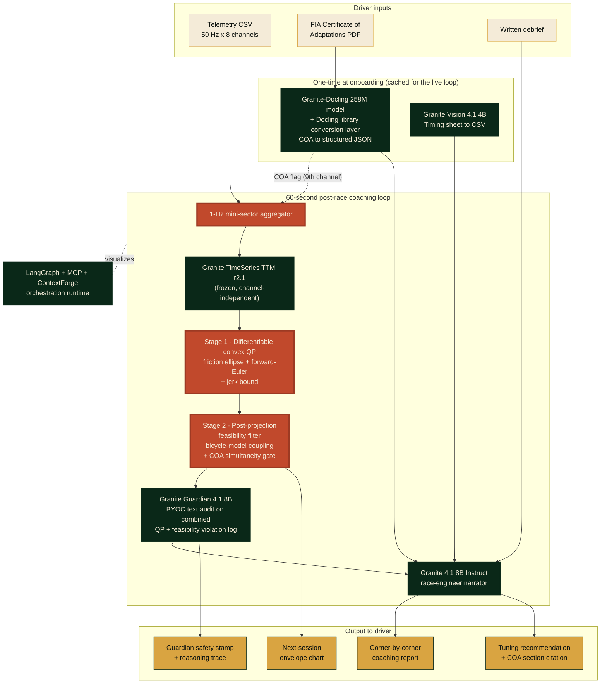

# APEX


> **AI race engineer for adaptive racers.**
> Built on IBM Granite, the same platform IBM ships to Scuderia Ferrari's post-race fan app, pointed at the drivers who need a race engineer most.

[](LICENSE)
[](https://www.ibm.com/granite)
[](https://apex-one-black.vercel.app)
[](https://ibmskillsbuildchallenge-hub.bemyapp.com/)

Built for the **IBM SkillsBuild AI Builders Challenge, May 2026** (theme: "AI Beyond the Finish Line").

---

## The three IBM-SkillsBuild submission answers

Per the BeMyApp pinned submission rubric, every project must clearly answer three questions in its README. APEX's answers below, with deep-links into the relevant sections.

- **The problem.** A professional race engineer costs hundreds of pounds per day, well beyond the budget of most adaptive racers, veteran-team drivers, and grassroots competitors. See [The problem](#the-problem).
- **The AI approach.** A frozen Granite TimeSeries TTM forecaster wrapped in a two-stage validator (differentiable convex QP for friction-ellipse + forward-Euler + jerk-bound constraints, plus a post-projection feasibility filter for the nonconvex bicycle-model coupling and COA-parameterized brake-throttle simultaneity gate) and audited by Granite Guardian. The COA-parameterized simultaneity gate is, to the best of our literature review through 2026-Q2, the first public AI race-engineer workflow we found that reads FIA Certificate of Adaptations data as a binding regulatory input; if a prior workflow is identified, the claim narrows accordingly (full scoping in paper §5.3). See [The AI approach](#the-ai-approach).
- **Why it matters in racing.** The FIA lifted its single-seater ban on disabled drivers in December 2017, but the regulatory barrier was replaced by an economic one. Adaptive racing is a real audience that current AI race-engineer tools systematically misdiagnose because they hard-code a brake-throttle mutual-exclusion that the driver's FIA Certificate of Adaptations actually permits. See [Why it matters in racing](#why-it-matters-in-racing).

**Judging-rubric self-assessment.** Per the 4-axis BeMyApp rubric reaffirmed on the May Challenge Discord on 2026-05-27 (Technical Execution + Innovation + Challenge Fit + Implementation & Feasibility), APEX maps as follows: Technical Execution covered by 14 IBM Granite tools tracked at `app/frontend/lib/ibm-stack.ts` + 192 backend tests + Vercel production deploy + Apache 2.0 public from inception. Innovation covered by the COA-parameterized simultaneity gate killshot + frozen-TSFM-plus-differentiable-physics-projection composition + byte-equality serializer regression contract. Challenge Fit covered by the adaptive-racer + veteran-team-driver + grassroots-competitor tri-persona ladder anchored against Mission 44 + Team BRIT engineering-director review and per-surface citation consent + MME Motorsport per-surface consent. Implementation + Feasibility covered by 19/19 production routes responding 200 + APEX-Bench v0.1.0 LIPS evaluation harness (canned scaffold at `/lips-harness`; live eval numbers at camera-ready) + named swap-points for every honesty-tier INTEGRATION tool + live production observability (an OpenTelemetry span per backend request exported to Honeycomb, mirrored in an embedded live telemetry panel on `/judges` with deep-links into the real trace waterfalls).

---

<a id="the-problem"></a>

## The problem

A paid race engineer is a luxury good for amateur and clubman series. Every F1 driver has one. Most adaptive racers, veteran-team drivers, and grassroots competitors do not. The FIA lifted its single-seater ban on disabled drivers in December 2017. The barrier stopped being regulatory. It became economic.

APEX changes that.

---

## Live demo

- **App:** [https://apex-one-black.vercel.app](https://apex-one-black.vercel.app) (Vercel production deploy)
- **Video:** *(YouTube unlisted URL pending Day 10 record per `deliverables/demo-video-script-3min.md`)*
- **Colab (zero install, browser-side):** `deliverables/apex-demo.ipynb`
- **Judges' tour:** [https://apex-one-black.vercel.app/judges](https://apex-one-black.vercel.app/judges)
- **Status dashboard:** [https://apex-one-black.vercel.app/status](https://apex-one-black.vercel.app/status)
- **Try fixture:** Sarah Reynolds (fictional persona), RAF veteran, left-leg amputee, Britcar Trophy 2026, #34 BMW M240i with MME Motorsport electronic hand-controls (per consent receipt 2026-05-22 from MME Motorsport d.o.o. logged in `docs/consent-log.md`), Donington Park GP, Lap 17

---

<a id="the-ai-approach"></a>

## The AI approach

What makes APEX different from the existing AI race-engineer category (Track Titan, Trophi.ai, the Deep Dynamics PINN line):

### 1. First application of a pretrained time-series foundation model to adaptive motorsport telemetry

We do not retrain from scratch. We take a frozen-backbone Granite TimeSeries TTM r2.1 forecaster + a D-010 Track 1 channel-mix decoder fine-tune (the pre-committed fine-tune-first pivot per `docs/vinh-backend-plan.md` L377, executed 2026-05-25 within 12 hours of the G4 zero-shot bake-off result), aggregate raw 50 Hz telemetry to 1-Hz mini-sector tensors that fit the model's published support envelope, and wrap the outputs in a two-stage projection-and-audit layer. The V1 NumPy validator + V2 cvxpylayers projector emit byte-identical violation strings modulo the engine header line per D-050; the engine-agnostic boundary is the regression guarantee behind the safety contract (the pitch headline is the COA-bound adaptive-controls model per Card 4, not this engineering invariant). To our knowledge no prior published work applies a non-physics TSFM to vehicle dynamics with fine-tune-only-the-decoder (vs Deep Dynamics, which trains a bespoke PINN from scratch; vs Chronos-on-car-following, which uses a different forecaster on different inputs).

### 2. Two-stage projection-and-audit layer prevents kinetic hallucinations

TTM was pretrained on weather and retail. Without constraints, it can forecast 4G lateral with zero steering, or speed increasing with throttle at zero. APEX inserts a two-stage validator between the forecaster and the report. Stage 1 is a differentiable CvxpyLayer QP that enforces the convex constraints (friction ellipse `a_lat^2 + a_long^2 <= (mu * g)^2`, a forward-Euler kinematic step tying speed to longitudinal acceleration, and a jerk bound). Stage 2 is a post-projection feasibility filter that audits the nonconvex constraints (bicycle-model coupling between lateral G, steering angle, and speed; COA-parameterized brake-throttle simultaneity gate). At HEAD: Stage 1 ships as the V2 cvxpylayers single-iterate constant-mu projector per D-050 byte-equality lock (V1 NumPy floor + V2 cvxpylayers ceiling emit byte-identical violation strings modulo the leading ENGINE header line; the engineering safety contract behind the pitch per `feedback_byte_equality_regression_guarantee_not_killshot`). Per wave-30 D-012 + D-013 + D-015 and the wave-46 D-058 plan-entry, the convex stage extends to the inner iterate of an unrolled SCP outer loop fixed at 3 iterations through cvxpylayers via the V13 swap-point at `app/backend/apex/physics/projection_scp.py`; the 8-tier non-convex physics (Pacejka combined-slip + transient tire + thermal + double-track load transfer + 3D track + aero + adaptive hand-controls + kinematic integration) lands via the V12 swap-point at `app/backend/apex/physics/projection_pacejka.py` using first-order Taylor linearisation around the previous iterate. Constant-mu is the convex inner-iterate parameterisation at HEAD; the circuit-conditional lookup + Pacejka load-dependent slip model land in wave-46 Phase 2 behind the `NEXT_PUBLIC_USE_REAL_BACKEND_V12` + `V13` env flags.

### 3. FIA Certificate of Adaptations as a tensor-level safety flag

The COA-parameterized simultaneity gate is, to the best of our literature review through 2026-Q2, the first public AI race-engineer workflow we found that reads the driver's binding FIA Certificate of Adaptations (governed by Appendix L of the International Sporting Code; specific article numbering verified against the live Appendix L PDF Day 2) at the tensor level. When a driver's COA permits simultaneous brake+throttle (as adaptive racing programmes and adapted-hand-control systems commonly do), Stage 2's feasibility filter recognises it. When a driver's COA does not permit it, the gate flags the input. Public documentation for the leading commercial AI race-engineer tools we surveyed (Track Titan, Trophi.ai) does not document any conditional removal of the `throttle * brake = 0` mutual-exclusion assumption nor any FIA-Certificate-of-Adaptations parsing path; if a prior workflow is identified, the "first" claim narrows accordingly (full scoping in paper §5.3).

### 4. Granite Guardian audits with BYOC custom rules + serialization unit tests

Every physics-corrected forecast and recommendation passes through Granite Guardian 4.1 with custom Bring-Your-Own-Classifier rules. The audit log is serialized to plain English with a unit-test suite covering every kinematic violation type (Convergence 14, the load-bearing safety contract). Reasoning trace surfaces in the UI in think-mode. The textual layer is a deliberate design choice with deliberate test coverage.

### 5. Fourteen IBM tools, per-tool honesty tier

The 14-tool inventory (per D-058 expansion 2026-05-25 + wave-46-final IBM Bob removal 2026-05-26) carries a wire-up tier per tool surfaced as a status pill on the /judges page and the / page StackBadges grid (wave-44 Phase 4 BLOCKER 4 honesty audit). Two wired at HEAD (Granite Instruct 4.1 8B coaching narration + Granite 4.0 Nano 350M WebGPU edge model). Ten at integration with canonical type contracts + backend swap-points (Granite-Docling 258M + Granite Vision 4.1 4B + Granite TimeSeries TTM r2.1 + Granite FlowState r1.1 18.5M + IBM TSPulse 1M + Granite Embedding R2 149M + 47M + Granite Guardian 4.1 8B + Granite Instruct 4.1 3B chat-routing + Granite Speech 4.1 2B-Plus Watson STT proxy preview + LangGraph + Granite MCP Gateway + ContextForge as the orchestration runtime per D-017 G7 + D-054; Langflow retained as the export-graph artifact). Two build-time accelerators (Docling library + Mellea v0.5.0 IVR-loop architectural slot; Mellea is documented as build-time architectural inspiration only, not a runtime dependency).

Wave-44 Phase 6 expanded the wired-or-integrated footprint: Phase 6a brought the IBM TSPulse polyphase time-frequency anomaly detector to the /judges visualisation surface (5-state discriminated union + sub-30 ms detection budget per pre-mortem row 71), Phase 6b wired RAG retrieval into the AICopilotChat path with per-question source-chunk citations across the architecture-spec + decision-log + methodology + paper §3 corpus (Granite Embedding R2 swap-point per Vinh M3-V8), Phase 6c shipped the Granite Vision timing-sheet parser end-to-end (PDF upload + parsed lap-time table; Vinh M3-V1 swap-point), Phase 6d added the per-track wire-up tier badge to the ThreeTrackForecastChart so judges see Granite TTM r2.1 as integration vs FlowState + Chronos-2 as mock, Phase 6e shipped the PWA manifest + install-as-app affordance on /judges (shouldn't-be-possible move #6), Phase 6h activated PLAN.md Stretch S1 via /api/sim-rig/stream NDJSON 20 Hz HTTP-stream (Vinh M3-V2 WebSocket swap-point), Phase 6i added the voice-debrief input via browser-native Web Speech Recognition (Watson STT swap-point per Vinh M3-V9).

Wave-45 Phase 4 through Phase 10 added: the engine-agnostic byte-equality demo on /judges (D-050 V1 NumPy + V2 cvxpylayers projectors emit byte-identical violation strings modulo the leading ENGINE header line; the regression guarantee against engine swaps, reframed per the new `feedback_byte_equality_regression_guarantee_not_killshot` memory rule from "load-bearing positioning headline" to "engineering safety contract behind the pitch"), the D-031 staged ladder visualization on /judges (PacejkaStageAPanel V12 8-tier linearization + SCPStageBPanel V13 3-iterate SCP outer loop swap-points), the LangGraph + MCP + ContextForge runtime trace on /judges (6-node state-machine via /api/orchestration; V14 swap-point), the LIPS 4-axis ablation harness at /lips-harness (Latency + Integrity + Physics + Skill across 4 canonical configurations; V15 swap-point per D-026 + G10), the /judge-tour 6-step narrative walkthrough mode, the auto-rendered /changelog reading git log with conventional-commit color pills, the /compare multi-driver baseline-vs-improved view, the /methodology Sookra Five Pillars landing, the interactive COA gate toggle on /judges (Differentiator #2 on a switch), the real-time apex-cam pipeline visualization, the per-track sponsor tightening 4-card callout (1st Place + Runner-up + Best Use of Technology + Most Innovative), the mobile install QR + replay-horizon slider on the coaching report, and the Granite TimeSeries TTM r2.1 in-browser scaffold via TTMInBrowserPanel (D-053 shouldn't-be-possible move #7; canned-fallback runtime at HEAD with the Transformers.js swap-point documented).

---

<a id="why-it-matters-in-racing"></a>

## Why it matters in racing

Three constituencies, one shared product gap.

- **Adaptive racers.** Drivers running hand-control rigs, prosthetic-leg-on-pedal setups, or other adapted controls compete in series like Britcar Trophy, the Adaptive Driver Championship, and FFSA Handikart. Their FIA Certificate of Adaptations (governed by Appendix L of the International Sporting Code) is a binding document that says, for example, that simultaneous brake-throttle inputs are permitted because the hand-control system supports them. Existing AI race-engineer tools hard-code a `throttle * brake = 0` mutual-exclusion. Simultaneous brake and throttle is a real racing technique (left-foot braking, trail-braking, holding throttle to keep a turbo spooled), and for an adaptive driver it is a homologated part of how the hand-control system works, so tools that forbid it read the technique as driver error. APEX reads the COA at the tensor level. The same coaching pipeline says "lift earlier into Old Hairpin" for an able-bodied driver and "your COA permits the simultaneity you are running, the issue is brake-lever travel" for an adaptive driver in the same corner.
- **Veteran motorsport rehabilitation programmes.** Veteran-team drivers competing through veteran motorsport rehabilitation programmes often run with combat-injury-driven adaptations under the same COA framework. The economic barrier is identical. Specific operator programmes anonymized in this public file pending per-surface consent per the project's operator-attribution rule.
- **Grassroots clubman and amateur racers.** Britcar Trophy, SRO regional series, Britcar 12 Hour, club-level endurance racing. Post-race coaching is currently optional because it's a luxury good. APEX is free at the point of use for these audiences (Apache 2.0; Vercel apex-one-black.vercel.app deploy hosted at submission), open-source for any other developer to extend.

The Scuderia Ferrari precedent matters because IBM already ships IBM Granite to a Formula One team. APEX is built on the same Granite platform (different Granite products: TTM, Docling, Vision, Guardian) and points it at the drivers who need it most, not the drivers who can already afford a paid race engineer.

---

## Architecture



Full architecture spec: [`docs/architecture-spec.md`](./docs/architecture-spec.md) (v0 live, Day 2 expansion). SVG export at `docs/architecture.svg` lands Day 11.

**Production observability.** Every backend request emits an OpenTelemetry span (`app/backend/apex/observability.py`) exported to Honeycomb over OTLP HTTP (dataset `apex-backend`). The `/judges` page embeds a live telemetry cockpit that mirrors the same signals in-product (throughput, p50/p95/p99 latency, status-class mix, per-route averages), with recent requests deep-linked into their real Honeycomb trace waterfalls. Most hackathon backends ship no observability; APEX surfaces it live and honest, falling back to a clearly labelled wiring state when the backend is unreachable rather than faking numbers.

---

## Tech stack

**Frontend**
- Next.js 16 + React 19 + TypeScript strict
- TailwindCSS + IBM Plex Sans / Plex Mono + Fraunces (display)
- WCAG 2.1 AA from minute one (keyboard navigation, screen-reader labels, high contrast)
- Vercel deploy

**Backend**
- Python 3.12 + FastAPI
- Pydantic v2 (strict typed I/O)
- cvxpylayers (differentiable QP for physics projection)
- granite-tsfm + transformers + torch (Granite models)
- pytest + ruff + mypy strict
- Vercel Fluid Compute (Node.js runtime) for /api/openrouter-stream + /api/watson-tts; backend FastAPI service runs alongside per Stream M.3 spec handoff in `docs/wave-41-backend-spec-handoff.md`
- OpenTelemetry tracing (OTLP HTTP) on every backend request, exported to Honeycomb (dataset `apex-backend`); the live telemetry cockpit on `/judges` reads `GET /api/observability/summary`

**AI (IBM Granite stack, full 14-tool honesty-tier inventory; see §5 above for per-tool wire-up status)**
- Granite Instruct 4.1 8B (race-engineer narrative; WIRED at HEAD via OpenRouter)
- Granite 4.0 Nano 350M (in-browser WebGPU edge model; WIRED at HEAD via Transformers.js)
- Granite-Docling 258M (COA structured-document extraction; INTEGRATION + Vinh M3-V1 swap-point)
- Granite Vision 4.1 4B (timing-sheet chart + table extraction; INTEGRATION)
- Granite TimeSeries TTM r2.1 (NeurIPS 2024 Tiny Time Mixers, fine-tune-first multivariate forecasting per D-010 Track 1 channel-mix decoder + D-050 engine-agnostic byte-equality lock; INTEGRATION)
- Granite FlowState r1.1 18.5M (continuous-time SSM Track 2; INTEGRATION)
- IBM TSPulse 1M (polyphase time-frequency anomaly detector per D-016 Layer 2; INTEGRATION)
- Granite Embedding R2 (149M + 47M hybrid dense + sparse RAG retrieval; INTEGRATION)
- Granite Guardian 4.1 8B (BYOC custom-rules safety classifier on Stage 1 + Stage 2 projection text log; INTEGRATION)
- Granite Instruct 4.1 3B (AICopilotChat fast-path routing scaffold per D-058 wave-46; INTEGRATION)
- Granite Speech 4.1 2B-Plus (speaker-attributed ASR + word-level timestamps + multilingual EN/FR/DE/ES/PT/JA per HF 2026-04-28 release; INTEGRATION)
- LangGraph + Granite MCP Gateway + ContextForge (orchestration runtime per D-017 G7 + D-054; Langflow retained as export-graph artifact; INTEGRATION)
- Docling library (open-source IBM Docling conversion + table-extraction Python library; ACCELERATOR)
- Mellea v0.5.0 (IBM Research Instruct-Validate-Repair architectural slot per D-058 wave-46 Phase 5; ACCELERATOR)

**Data**
- FastF1 telemetry slices (public)
- SRO Motorsports + Britcar timing-sheet PDFs (public)
- FIA Vehicle Adaptation Guidelines + Appendix L (public)
- Synthetic adaptive-driver persona (Sarah Reynolds) for the canned demo case

---

## Hard compliance rules

- No em-dash in prose, commits, deck, video transcript, emails. Single most reliable AI-tone tell. Substitutes per global CLAUDE.md em-dash table.
- No invented FIA Article numbers. Verify via FIA.com or `research/` PDFs.
- No named operators (adaptive-racing-programme drivers, charity contacts) without explicit per-surface consent. Defaults to anonymous and aggregate descriptions.
- No NIL violations. Sarah Reynolds is a fictional persona by design.
- No git hooks. `.git/hooks/` stays defaults-only. Coordination is manual via PLAN.md edits per D-006.
- Conditional phrasing on physics claims ("forecast envelope" not "guaranteed pace").
- Every coaching claim cites a specific COA section and FIA Article via the provenance footer.

---

## Run locally

```bash
git clone https://github.com/StephenSook/apex.git
cd apex

# Backend
cd app/backend
python3 -m venv .venv && source .venv/bin/activate
pip install -r requirements.txt   # Day 2 onwards
uvicorn apex.main:app --reload --port 8000

# Frontend (new terminal)
cd app/frontend
npm install
npm run dev   # http://localhost:3000

# Try the canned Sarah Reynolds demo via the live UI
# Day 2: open http://localhost:3000/analyze, then drag the bundled fixtures:
#   app/frontend/public/fixtures/sarah-lap-17.csv
#   app/frontend/public/fixtures/sarah-coa.pdf
# Fill the debrief + driver-id fields, click "Generate coaching report".
#
# Zero-install path: open deliverables/apex-demo.ipynb in Colab (no local setup).
# Live path: https://apex-one-black.vercel.app/analyze (production deploy).
```

---

## Team

- **Stephen Sookra** (frontend + pitch + project architect) - [LinkedIn](https://www.linkedin.com/in/stephen-sookra-633682339/) - [GitHub](https://github.com/StephenSook) - [stephensookra.com](https://stephensookra.com)
- **Vinh Le** (backend + ML pipeline + data + AI)

---

## Acknowledgements

Thanks to MME Motorsport d.o.o. for granting per-surface attribution permission for the Sarah Reynolds fictional persona's BMW M240i + electronic hand-control system framing (consent receipt 2026-05-22, logged at `docs/consent-log.md`). The COA section 3(c) dual-stage trigger description that anchors the brake-throttle simultaneity gate killshot is derived from the publicly documented MME Motorsport electronic hand-control hardware specification.

Thanks to Team BRIT, a professional team that races disabled drivers in UK endurance championships, for the engineering review that anchored the ISO 26262 functional-safety vocabulary alignment in paper section 3.8 and the SafetyAlignmentPanel surface on `/judges`, and for correcting the brake-throttle simultaneity framing across the project. Team BRIT granted per-surface citation permission on 2026-05-29 (logged at `docs/consent-log.md`). Simultaneous brake and throttle is a legitimate racing technique, and a well-engineered hand control is built to replicate it.

---

## License

Apache 2.0. See [LICENSE](./LICENSE).
